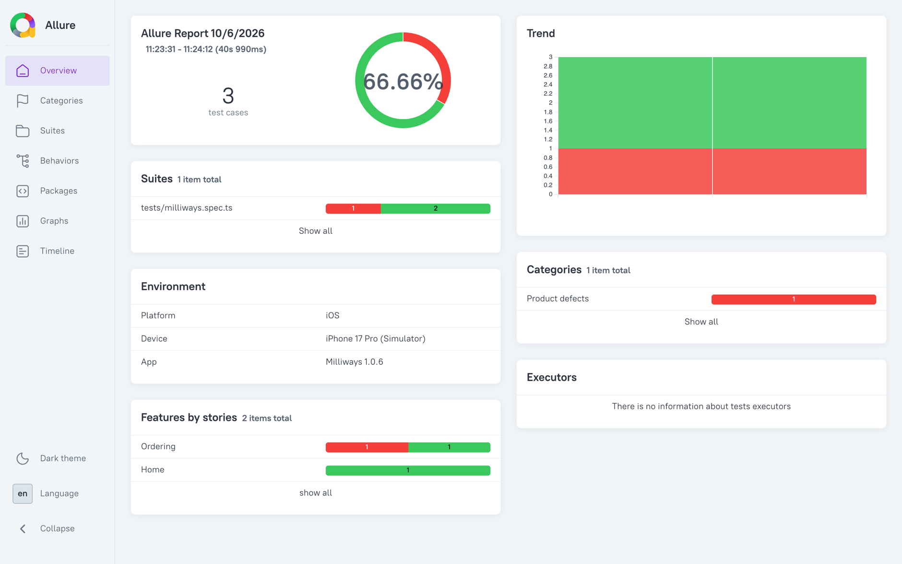
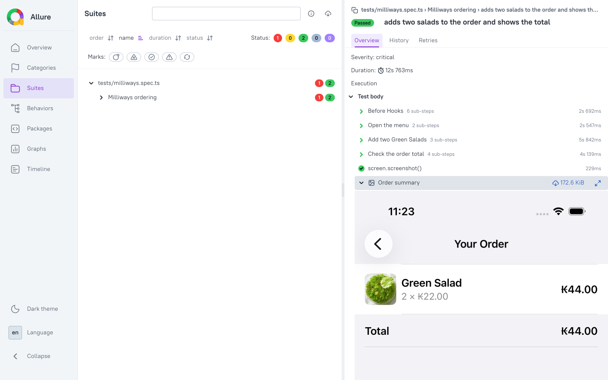
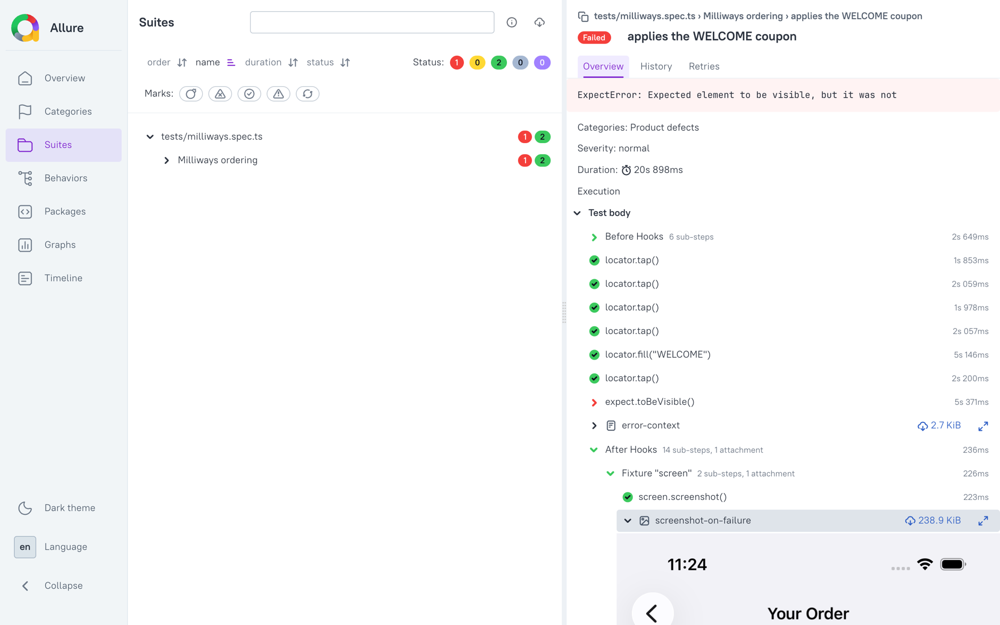

# Allure Report

[Allure Report](https://allurereport.org) is an open-source test reporting tool that turns the results of a test run into a static HTML site. It shows every test with its steps and attachments, groups tests by feature and severity, and keeps a history across runs so you can see trends and flaky tests over time.

Mobilewright is built on the Playwright test runner, so the standard [`allure-playwright`](https://allurereport.org/docs/playwright/) reporter works without any changes. Every Mobilewright action (`locator.tap()`, `locator.fill()`, `expect.toBeVisible()`, …) shows up as a step, and the screenshot Mobilewright takes when a test fails is attached to the failed step automatically.



This guide runs a small suite against the [Milliways](https://github.com/mobile-next/milliways-ios) sample app on an iOS simulator, generates the report locally, and then shows how to produce and publish the same report from CI.

## Setup

### 1. Install the reporter and the Allure CLI

```bash
npm install --save-dev allure-playwright allure-commandline
```

`allure-playwright` writes a results file per test while the suite runs. `allure-commandline` is the tool that turns those results into the HTML report. It needs a Java runtime (JRE 8 or newer) on your `PATH`; run `java -version` to check.

### 2. Add the reporter to your config

Add `allure-playwright` to the `reporter` array in `mobilewright.config.ts`. Keep `list` so you still get output in the terminal:

```ts
import { defineConfig } from 'mobilewright';

export default defineConfig({
  platform: 'ios',
  bundleId: 'com.mobilenext.Milliways',
  deviceName: /iPhone/,
  reporter: [
    ['list'],
    ['allure-playwright', {
      resultsDir: 'allure-results',
      environmentInfo: {
        Platform: 'iOS',
        Device: 'iPhone 17 Pro (Simulator)',
        App: 'Milliways 1.0.6',
      },
    }],
  ],
});
```

`resultsDir` is where the raw results go (`allure-results` is the default). `environmentInfo` is optional; whatever you put there is shown in the **Environment** panel on the report overview.

Add `allure-results` and `allure-report` to `.gitignore`.

### 3. Write a test

The suite below orders two salads in Milliways and checks the total. It uses three things from Allure on top of the normal Mobilewright API:

- `allure.step()` groups actions under a readable name in the report.
- `allure.feature()` and `allure.severity()` are labels. Allure uses them to group tests on the **Behaviors** page and to sort by importance.
- `allure.attachment()` adds a file to the test. Here it attaches a screenshot of the final order screen.

```ts title="tests/milliways.spec.ts"
import { test, expect } from '@mobilewright/test';
import * as allure from 'allure-js-commons';

test.describe('Milliways ordering', () => {
  test('home screen shows the welcome message', async ({ screen }) => {
    await allure.feature('Home');
    await expect(screen.getByText('Welcome to Milliways')).toBeVisible();
    await expect(screen.getByText('New Order')).toBeVisible();
  });

  test('adds two salads to the order and shows the total', async ({ screen }) => {
    await allure.feature('Ordering');
    await allure.severity('critical');

    await allure.step('Open the menu', async () => {
      await screen.getByText('New Order').tap();
      await expect(screen.getByText('MAIN DISHES')).toBeVisible();
    });

    await allure.step('Add two Green Salads', async () => {
      await screen.getByText('Green Salad').tap();
      await screen.getByRole('button', { name: '+' }).tap();
      await screen.getByRole('button', { name: 'Add to Order' }).tap();
    });

    await allure.step('Check the order total', async () => {
      await screen.getByRole('button', { name: '2' }).tap();
      await expect(screen.getByText('Your Order')).toBeVisible();
      await expect(screen.getByText('2 × ₭22.00')).toBeVisible();
      await expect(screen.getByText('₭44.00').first()).toBeVisible();
    });

    const screenshot = await screen.screenshot();
    await allure.attachment('Order summary', screenshot, 'image/png');
  });

  test('applies the WELCOME coupon', { tag: '@demo-failure' }, async ({ screen }) => {
    await allure.feature('Ordering');
    await screen.getByText('New Order').tap();
    await screen.getByText('Soup of the Day').tap();
    await screen.getByRole('button', { name: 'Add to Order' }).tap();
    await screen.getByRole('button', { name: '1' }).tap();
    await screen.getByPlaceholder('Coupon code').fill('WELCOME');
    await screen.getByRole('button', { name: 'Apply' }).tap();
    await expect(screen.getByText('Discount')).toBeVisible();
  });
});
```

`allure-js-commons` is installed as a dependency of `allure-playwright`, so there is nothing extra to install for the import.

The last test fails on purpose: Milliways does not accept the `WELCOME` coupon, so the final assertion does not hold. It is there to show what a failure looks like in the report. It carries the `@demo-failure` tag so the CI example below can leave it out with `--grep-invert`; delete it once you have seen the report.

### 4. Run the tests

Boot a simulator, install Milliways on it (download `Milliways-simulator.zip` from the [latest release](https://github.com/mobile-next/milliways-ios/releases/latest), unzip it, and run `xcrun simctl install booted Milliways.app`), then run the suite as usual:

```bash
npx mobilewright test
```

```
Running 3 tests using 1 worker

  ✓  1 tests/milliways.spec.ts:5:7 › Milliways ordering › home screen shows the welcome message (1.3s)
  ✓  2 tests/milliways.spec.ts:11:7 › Milliways ordering › adds two salads to the order and shows the total (12.7s)
  ✘  3 tests/milliways.spec.ts:37:7 › Milliways ordering › applies the WELCOME coupon (20.8s)

  1 failed
  2 passed (44.1s)
```

The run leaves a JSON file per test, plus the attachments, in `allure-results/`.

### 5. Generate and open the report

```bash
npx allure generate allure-results --clean -o allure-report
npx allure open allure-report
```

`generate` writes the static site to `allure-report/`. `open` serves it on a local port and opens it in your browser. To do both in one step without keeping the report on disk, run `npx allure serve allure-results` instead.

## Reading the report

**Overview** is the landing page from the screenshot at the top: pass rate, the suites and features with their pass/fail split, the environment you configured, and the trend chart once there is history (see below).

**Suites** lists every test by file and `describe` block. Click a test to see its steps. Steps you wrapped in `allure.step()` appear under the name you gave them, and everything else appears under the Mobilewright action name. The attachment you added with `allure.attachment()` is shown inline:



For a failed test the error is shown at the top, the failing step is marked, and the screenshot Mobilewright takes on failure is attached under the `screen` fixture in **After Hooks**, so you see exactly what was on the device when the assertion failed:



The `error-context` attachment on a failed test is the same Markdown file Mobilewright writes to `test-results/`, with the error, the source around the failing line, and the view tree.

### Keeping history between runs

The **Trend** chart and the per-test **History** tab are empty on the first run. Allure builds them from a `history/` folder inside the previous report. Start the next run with an empty results directory, so results from the previous run are not mixed in as retries, then copy the previous report's history into it before generating:

```bash
rm -rf allure-results
npx mobilewright test
cp -r allure-report/history allure-results/history
npx allure generate allure-results --clean -o allure-report
```

Do this on every run and the report accumulates the previous runs. In CI, this means the previous report has to be downloaded before generating the new one; the examples below show how.

## CI example (GitHub Actions)

The workflow below runs the suite on a macOS runner, generates the report, and uploads it as a build artifact. The `java` step is only there because `allure-commandline` needs it.

```yaml
name: Mobilewright Tests
on:
  push:
    branches: [main]
  pull_request:
    branches: [main]

permissions:
  contents: read

jobs:
  test:
    runs-on: macos-latest
    steps:
      - uses: actions/checkout@v4
      - uses: actions/setup-node@v4
        with:
          node-version: 24
      - uses: actions/setup-java@v4
        with:
          distribution: temurin
          java-version: 21

      - run: npm ci

      - name: Install the app on the simulator
        run: |
          curl -sL -o Milliways-simulator.zip \
            https://github.com/mobile-next/milliways-ios/releases/latest/download/Milliways-simulator.zip
          unzip -q Milliways-simulator.zip
          xcrun simctl boot "iPhone 16 Pro"
          xcrun simctl install booted Milliways.app

      - name: Run Mobilewright tests
        run: npx mobilewright test --grep-invert @demo-failure

      - name: Generate Allure report
        if: ${{ !cancelled() }}
        run: npx allure generate allure-results --clean -o allure-report

      - uses: actions/upload-artifact@v4
        if: ${{ !cancelled() }}
        with:
          name: allure-report
          path: allure-report/
          retention-days: 30
```

`if: ${{ !cancelled() }}` keeps the report steps running when tests fail, which is when you want the report most. Download the artifact from the workflow summary, unzip it, and run `npx allure open <folder>` locally.

### Publishing the report

A downloaded artifact is fine for a single run but loses the history. To get a report with trends that the whole team can open from a link, publish it somewhere that keeps the previous version around.

**GitHub Pages.** Keep the published reports on a `gh-pages` branch. Before generating, check out that branch and copy the last report's `history/` into `allure-results/`; after generating, push the new report. Pushing needs `contents: write` on the job, which overrides the read-only default set above. Publish only from `push` runs so a pull request cannot replace the shared report. Add the permission to the job and replace the generate and upload steps with:

```yaml
  test:
    runs-on: macos-latest
    permissions:
      contents: write
    steps:
      # ... checkout, setup, install app, run tests as above ...

      - name: Fetch previous report history
        if: ${{ !cancelled() }}
        uses: actions/checkout@v4
        continue-on-error: true
        with:
          ref: gh-pages
          path: gh-pages

      - name: Generate Allure report with history
        if: ${{ !cancelled() }}
        run: |
          mkdir -p allure-results/history
          cp -r gh-pages/history/* allure-results/history/ 2>/dev/null || true
          npx allure generate allure-results --clean -o allure-report

      - name: Publish to GitHub Pages
        if: ${{ !cancelled() && github.event_name == 'push' }}
        uses: peaceiris/actions-gh-pages@v4
        with:
          github_token: ${{ secrets.GITHUB_TOKEN }}
          publish_dir: allure-report
```

The report is then available at `https://<org>.github.io/<repo>/`. The `gh-pages` branch does not exist on the first run; `continue-on-error: true` lets that checkout fail without stopping the job, and the publish step creates the branch.

**Amazon S3.** Sync the report to a bucket with static website hosting enabled. Keep one copy per commit and one at a stable path for the latest run:

```yaml
      - name: Fetch previous report history
        if: ${{ !cancelled() }}
        run: |
          mkdir -p allure-results/history
          aws s3 sync s3://my-reports-bucket/allure/latest/history allure-results/history

      - name: Generate Allure report with history
        if: ${{ !cancelled() }}
        run: npx allure generate allure-results --clean -o allure-report

      - name: Upload to S3
        if: ${{ !cancelled() && github.event_name == 'push' }}
        run: |
          aws s3 sync allure-report s3://my-reports-bucket/allure/runs/${{ github.sha }}
          aws s3 sync allure-report s3://my-reports-bucket/allure/latest --delete
```

This needs AWS credentials in the job, for example through `aws-actions/configure-aws-credentials`; with OIDC that also needs `id-token: write` in the job's `permissions`. The report is a plain static site, so any static host works the same way: the only requirement for trends is that `history/` from the previous report ends up in `allure-results/` before `allure generate` runs.

## Configuration

Options for the `allure-playwright` reporter entry in `mobilewright.config.ts`:

| Option | Description |
|---|---|
| `resultsDir` | Where results are written. Default: `allure-results`. |
| `environmentInfo` | Key/value pairs shown in the **Environment** panel on the overview. |
| `detail` | Set to `false` to hide Playwright's own steps (hooks, fixtures) and only show your `allure.step()` calls. Default: `true`. |
| `suiteTitle` | Set to `false` to stop using the test file as the suite name. Default: `true`. |
| `links` | Patterns that turn `allure.issue()` and `allure.tms()` IDs into links to your issue tracker. |
| `categories` | Custom defect categories, matched by status and error message, for the **Categories** page. |

The full list is in the [Allure Playwright reference](https://allurereport.org/docs/playwright-reference/).
